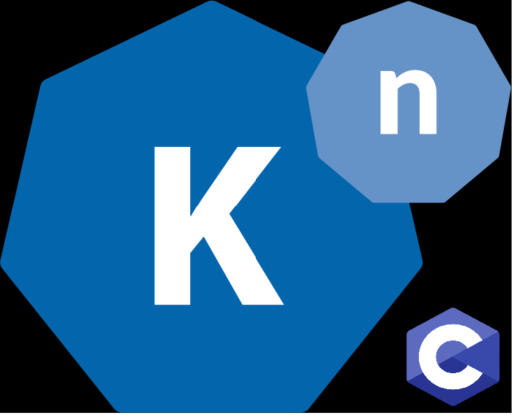

<br></br><br></br><br></br><br></br>
> Small Knative Example

[](https://github.com/cez-aug/github-project-boilerplate) [](https://creativecommons.org/publicdomain/zero/1.0/)

<br><br><br>
# Knative-helloworld-C

## A small example for running C in Knative

This is currently only half function, I don't have a lot of C experince so as of right now this has the following bugs:
* The service does launch to knative, but at this time when you delete the function or the function attempts to scale to zero, Kubernetes does not know how to tell the container's web server to turn off which causes the funtion to hang in terminating forever.  
  * As a temporary work around, you can shut down your kubernetes cluster nodes and turn them back on. This clears the function from running at the docker level. However this is a pain to deal with.
* While the Server responed when you call it, the way it returns the message is jacked up. What do you mean by jacked up you may ask? I will give an example of what I see from the terminal below when I run the C function locally in just a docker container, and then what I see when I run the C function from Knative. How to build this locally is below.

## To build this hello world function locally without Knative

### Pre Reqs
* ```sudo yum install -y vim```
* ```sudo yum group install -y "Developer Tools"```
* Install [docker](https://docs.docker.com/engine/install/centos/)

### BUild and Run Locally
To build this code, clone the repo, cd into the repository and run the following commands
```
cd knative-hello-world-c/
gcc helloworld.c -o server
./server
```

### Testing the C web server
You can then open a seperate terminal window and curl the server on port 8080
```
curl http://localhost:8080
#curl: (56) Recv failure: Connection reset by peer
#Hello World from your C Program!
```

## Running in knative

### Build the container
To build the container you will deploy to knative, simply build and push the container to your docker repo
```
#from inside this repo folder
docker build -t <your repo>/helloworld-c:<your tag> .
docker push <your repo>/helloworld-c:<your tag>
```

## Another Approach
There is this set of Go Libraries used for retrofitting C and C++ into the Go compiler. This could be explored, but we need to make sure the performace doesn't take too big of a hit. This repo may be able to be used to instead build the final C container into a Go based container and simply run the C code in the GoLand Compiler

https://github.com/xlab/c-for-go
